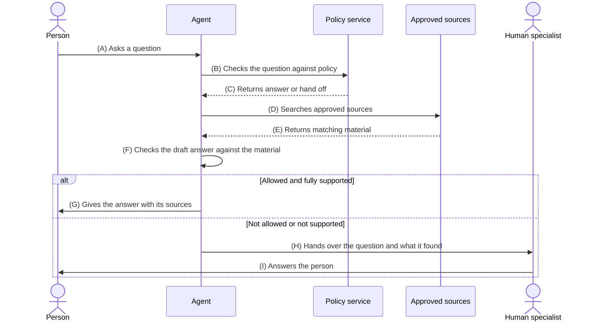

# Question answering agent with a handoff to a human

## The requirement

A person asks a question. An agent decides whether it is allowed to answer that question. The decision is made against a written policy. If the agent answers, the answer must be supported by approved source material and nothing else. If the agent cannot answer, or the answer is not supported, it hands the question to a human.

## Sequence diagram



## Flow table

| # | Title | Prompt | Policy | Reviewed |
|---|-------|--------|--------|----------|
| (A) | Asks a question | Not applicable. This step takes the question in and does not use a prompt. | [intake](#a-intake) | No |
| (B) | Checks the question against policy | Read the question below. Name the topic in one or two words. Say whether that topic is on the allowed list or the handoff list. If you cannot place it, say unknown. Do not answer the question. | [topic-check](#b-topic-check) | No |
| (C) | Returns answer or hand off | Not applicable. This step records the decision and does not use a prompt. | [decision-record](#c-decision-record) | No |
| (D) | Searches approved sources | Turn the question into a short search query. Use the words the person used. Return the query and nothing else. | [source-list](#d-source-list) | No |
| (E) | Returns matching material | Not applicable. This step returns passages from the sources and does not use a prompt. | [evidence](#e-evidence) | No |
| (F) | Checks the draft answer against the material | Here is a draft answer and the material it came from. For every sentence in the draft, name the passage that supports it. Delete any sentence you cannot support. Return the remaining answer and the list of sources. If no sentence survives, return NO ANSWER. | [grounding](#f-grounding) | No |
| (G) | Gives the answer with its sources | Answer the question in plain English using only the checked material. Keep it under 150 words. List the sources at the end. If the material does not answer the question, say that instead. | [response](#g-response) | No |
| (H) | Hands over the question and what it found | Write a short handover note for a human specialist. Include the question, the topic, the reason the agent stopped and any material that was found. Do not include a draft answer. | [handoff](#h-handoff) | No |
| (I) | Answers the person | Not applicable. A human writes this answer. | [human-response](#i-human-response) | No |

## Policy documents

### (A) intake

```json
{
  "id": "intake",
  "channels": ["web chat", "email"],
  "max_question_length": 1000,
  "strip_personal_data": true,
  "log_question": true
}
```

### (B) topic-check

```json
{
  "id": "topic-check",
  "allowed_topics": ["account setup", "billing basics", "product features", "how to guides"],
  "handoff_topics": ["refunds", "legal", "security incidents", "health", "complaints"],
  "on_unknown_topic": "hand off",
  "person_can_ask_for_a_human": true
}
```

### (C) decision-record

```json
{
  "id": "decision-record",
  "record": ["question_id", "topic", "decision", "reason", "timestamp"],
  "retention_days": 90
}
```

### (D) source-list

```json
{
  "id": "source-list",
  "sources": ["help centre", "published release notes", "pricing page"],
  "exclude": ["internal notes", "draft pages", "the model's own knowledge"],
  "max_results": 5
}
```

### (E) evidence

```json
{
  "id": "evidence",
  "min_results": 1,
  "max_age_days": 180,
  "require_source_url": true,
  "on_no_results": "hand off"
}
```

### (F) grounding

```json
{
  "id": "grounding",
  "every_sentence_needs_a_source": true,
  "allow_outside_knowledge": false,
  "min_supported_ratio": 1.0,
  "on_fail": "hand off"
}
```

### (G) response

```json
{
  "id": "response",
  "max_words": 150,
  "show_sources": true,
  "no_advice_topics": ["legal", "health", "financial"],
  "tone": "plain English",
  "say_when_the_material_falls_short": true
}
```

### (H) handoff

```json
{
  "id": "handoff",
  "reasons": ["topic not allowed", "topic unknown", "no supporting material", "answer not supported", "person asked for a human"],
  "include": ["question", "topic", "reason", "sources found"],
  "exclude": ["unchecked draft answer"],
  "target_queue": "support specialists",
  "tell_the_person": true
}
```

### (I) human-response

```json
{
  "id": "human-response",
  "first_response_minutes": 60,
  "record_answer": true,
  "add_gaps_to_sources": true
}
```

## How the agent avoids making things up

The agent never answers from memory. It answers only from the passages returned at step (E). Step (F) checks every sentence against those passages and deletes any sentence it cannot match. If nothing survives that check, the question goes to a human at step (H).

Author: mattcam
