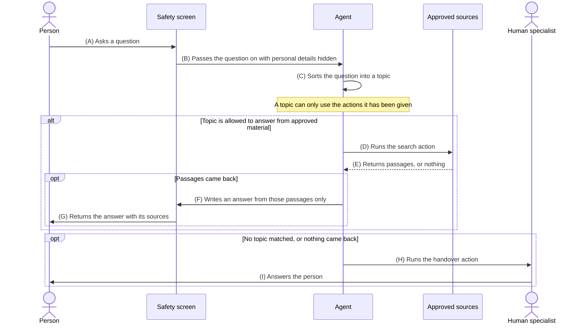

# Question answering agent with a handoff to a human

## The requirement

A person asks a question. An agent works out whether the question is one it is allowed to answer. If it is, the agent answers using approved source material and nothing else. If the question is outside what the agent covers, or the approved material does not answer it, the question goes to a person.

The answer must not be made up. That is not done by asking the agent to be careful. It is done by limiting what the agent is given to work with, so there is nothing to make up from, and by sending the question to a person the moment the material runs out.

## Sequence diagram



## Flow table

| # | Title | Prompt, asked of the model | Policy, enforced in the build | Reviewed |
|---|-------|----------------------------|-------------------------------|----------|
| (A) | Asks a question | Not applicable. The question arrives before the model has a turn. | [intake](#a-intake) | No |
| (B) | Passes the question on with personal details hidden | Not applicable. This screen runs on every question and the agent cannot skip it. | [safety-screen](#b-safety-screen) | No |
| (C) | Sorts the question into a topic | Read the question. Match it to one of the topics below using each topic description. Return the topic name only. If none of them fit, return no topic. | [topics](#c-topics) | No |
| (D) | Runs the search action | Turn the question into a short search query. Use the words the person used. Return the query and nothing else. | [search-action](#d-search-action) | No |
| (E) | Returns passages, or nothing | Not applicable. The search returns what it finds. | [evidence](#e-evidence) | No |
| (F) | Writes an answer from those passages only | Answer the question using only the passages below. Do not use anything you know from outside them. Keep it under 150 words in plain English. Name the passage behind each point. If the passages do not cover the question, say so and offer to pass it to a person. | [grounding](#f-grounding) | No |
| (G) | Returns the answer with its sources | Not applicable. The screen checks the answer and adds the sources on the way out. | [response](#g-response) | No |
| (H) | Runs the handover action | Write a short handover note for a person. Include the question, the topic, the reason the agent stopped and any passages that were found. Do not include a draft answer. | [handover](#h-handover) | No |
| (I) | Answers the person | Not applicable. A person writes this answer. | [human-response](#i-human-response) | No |

Read the last two columns as a pair. The prompt column is what the model is asked to do and a request can be turned down. The policy column is what the build makes true whether the model cooperates or not. Anything that has to hold every single time belongs in the policy column.

## Policy documents

### A intake

```json
{
  "id": "intake",
  "channels": ["web chat", "email"],
  "max_question_length": 1000,
  "log_question": true
}
```

### B safety-screen

```json
{
  "id": "safety-screen",
  "runs_on": ["every question in", "every answer out"],
  "hide_personal_details": ["name", "email", "phone", "card number"],
  "block_harmful_language": true,
  "keep_audit_record": true,
  "agent_can_skip_this": false
}
```

### C topics

```json
{
  "id": "topics",
  "topics": [
    {
      "name": "product help",
      "covers": ["account setup", "billing basics", "product features", "how to guides"],
      "actions": ["search approved sources", "hand over to a person"]
    },
    {
      "name": "needs a person",
      "covers": ["refunds", "legal", "security", "health", "complaints", "the person asked for a human"],
      "actions": ["hand over to a person"]
    }
  ],
  "no_topic_matched": "hand over to a person"
}
```

### D search-action

```json
{
  "id": "search-action",
  "sources": ["help centre", "published release notes", "pricing page"],
  "exclude": ["internal notes", "draft pages"],
  "max_passages": 5,
  "available_to_topics": ["product help"]
}
```

### E evidence

```json
{
  "id": "evidence",
  "min_passages": 1,
  "max_age_days": 180,
  "require_source_url": true,
  "on_nothing_found": "hand over to a person"
}
```

### F grounding

```json
{
  "id": "grounding",
  "the_model_is_given": ["the question", "the passages that came back"],
  "outside_knowledge": "not available to the model",
  "every_point_needs_a_passage": true,
  "if_the_passages_fall_short": "say so and offer a person"
}
```

### G response

```json
{
  "id": "response",
  "max_words": 150,
  "show_sources": true,
  "screen_before_sending": true,
  "no_advice_topics": ["legal", "health", "financial"],
  "tone": "plain English"
}
```

### H handover

```json
{
  "id": "handover",
  "is_an_action_the_agent_can_run": true,
  "reasons": ["no topic matched", "topic needs a person", "nothing found in the sources", "the person asked for a human"],
  "include": ["question", "topic", "reason", "passages found"],
  "exclude": ["unsent draft answer"],
  "queue": "support specialists",
  "tell_the_person": true
}
```

### I human-response

```json
{
  "id": "human-response",
  "first_response_minutes": 60,
  "record_answer": true,
  "add_gaps_to_sources": true
}
```

## Why the agent cannot make the answer up

At step (F) the model is handed the question and the passages from step (E). It has nothing else. There is no step where the agent writes an answer from memory and something else checks it afterwards, because a check like that is only as good as the model doing the checking.

Three things carry the requirement and none of them are wording in a prompt:

1. A topic can only run the actions it has been given, so a question about refunds has no way to reach the search action.
2. The search only reaches approved sources, so the passages are the whole of what the model has to draw on.
3. An empty search result runs the handover action. Nothing found means a person answers, not that the agent tries harder.

Author: mattcam
